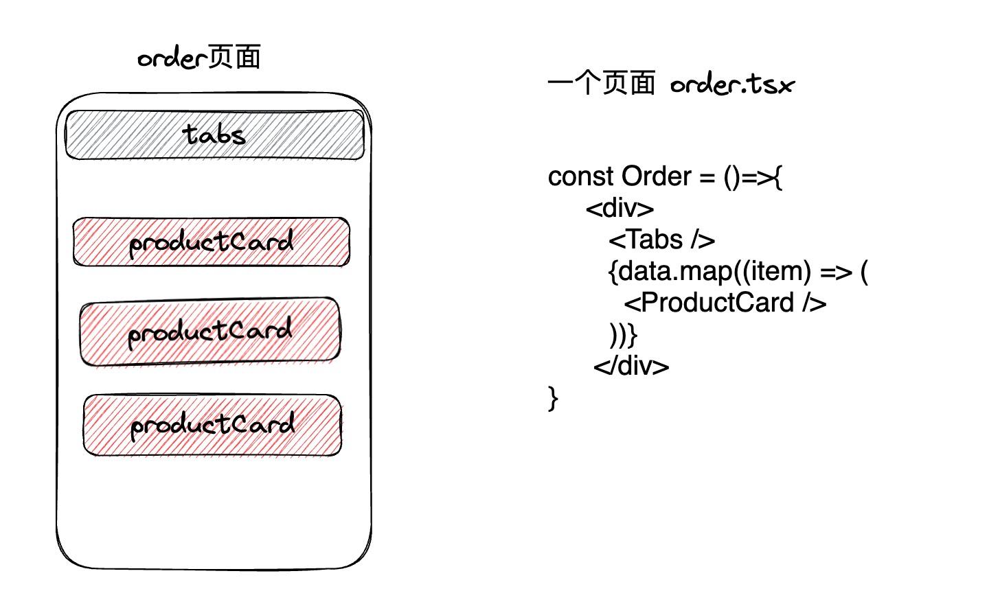
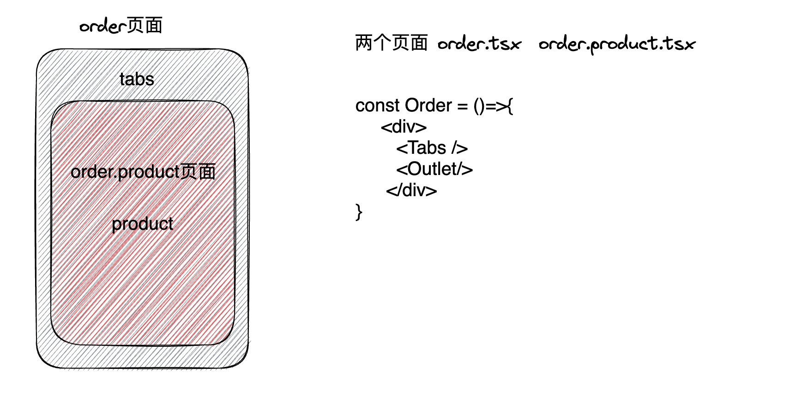

## 项目简介

前端项目使用 [remix](https://remix.run/docs/en) SSR 服务端渲染、由前端编写 BFF 层。css 使用[tailwindcss](https://www.tailwindcss.cn/docs) 、 图表使用 `echarts` 、国际化使用 `react-i18next` 、移动端适配使用`postcss-px-to-viewport`、grpc 使用 `bufbuild`、ui 组件库使用 antd ，动画特效 使用 `framer-motion`

## remix 思想

1、使用客户端渲染，包括使请求数据/和页面代码的分离。
2、基于嵌套路由的思想去规划页面
3、使用浏览器/html 原生的功能如<link rel=prefetch>
4、路由化

- 根据组件化思想 原来的页面构造 你的页面代码

- 按照路由的思想去划分页面 进行嵌套实现解耦，减少单页面代码冗余，也减少单页面多个请求 action 的问题

<!-- ## 静态资源

统一使用 webp 格式的图片 -->
